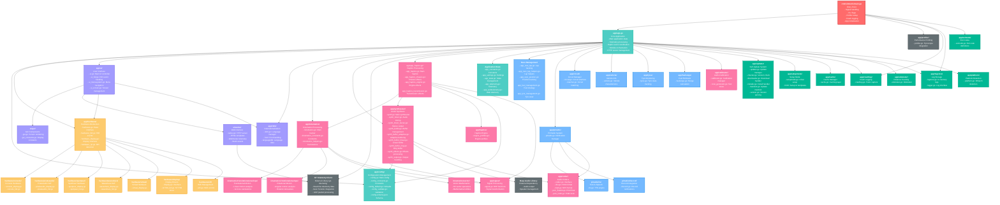

```mermaid
graph TD
    %% Entry Point
    Main["`**cmd/simtezilo/main.go**
    Entry Point
    - Signal handling
    - CLI flags
    - Profiler setup
    - Crash logging
    - App initialization`"]

    %% Core App Module
    App["`**app/app.go**
    Core Application
    - Main application state
    - Telemetry processing
    - Haptic event coordination
    - Module orchestration
    - HTTP server management`"]

    %% Configuration
    Config["`**app/config/**
    Configuration Management
    - config.go: Main config
    - config_constants.go: Constants
    - config_default.go: Defaults
    - config_validate.go: Validation
    - config.schema.json: Schema`"]

    %% Hardware Layer
    Hardware["`**app/hardware/**
    Hardware Abstraction
    - hardware.go: Base interface
    - hardware_hid.go: HID events
    - hardware_display.go: Display interface
    - hardware_rpi.go: RPi detection`"]
    
    HW_Console["`**hardware/console/**
    Console Hardware
    - console_display.go
    - console_hid.go`"]
    
    HW_PirateAudio["`**hardware/pirateaudio/**
    PirateAudio HAT
    - pirateaudio_display.go
    - pirateaudio_hid.go`"]
    
    HW_SpotPear["`**hardware/spotpear/**
    SpotPear Hardware
    - spotpear_display.go
    - spotpear_hid.go`"]
    
    HW_Waveshare["`**hardware/waveshare/**
    Waveshare HAT
    - waveshare_display.go
    - waveshare_hid.go`"]

    HW_Virtual["`**hardware/virtual/**
    Virtual Hardware
    - virtual_display.go`"]

    HW_Display["`**hardware/display/**
    Display Drivers
    - display.go: Interface
    - st7789_lcd.go: ST7789 driver`"]

    HW_WiFi["`**hardware/wifi/**
    WiFi Management
    - wifi.go: WiFi control`"]

    %% UI Layer
    UI["`**app/ui/**
    User Interface
    - ui.go: Main UI controller
    - ui_hid.go: HID event handling
    - ui_menusystem.go: Menu navigation
    - ui_screen.go: Screen management`"]
    
    GUI["`**ui/gui/**
    GUI Components
    - gui.go: Screen rendering
    - gui_constants.go: Display constants`"]
    
    WebUI["`**ui/webui/**
    Web Interface
    - webui.go: HTTP server
    - HTML templates
    - WebSocket telemetry
    - Static assets`"]

    %% Internationalization
    I18N["`**app/i18n/**
    Internationalization
    - i18n.go: Language manager
    - font/: Font handling
    - languagedb/: Language data`"]

    %% Kinematics Engine
    Kinematics["`**app/kinematics/**
    Kinematics Processing
    - kinematics.go: Main tracker
    - kinematics_constants.go: Constants
    - kinematics_helpers.go: Calculations`"]
    
    KIN_Translation["`**kinematics/translationalenvelope/**
    Translational Motion
    - Linear motion analysis
    - G-force calculations`"]
    
    KIN_Rotation["`**kinematics/rotationalenvelope/**
    Rotational Motion
    - Angular motion analysis
    - Rotation derivatives`"]
    
    KIN_Vector["`**kinematics/vector/**
    Vector Mathematics
    - 3D vector operations
    - Mathematical utilities`"]

    %% Audio Synthesis
    Synth["`**app/synthesizer/**
    Audio Synthesis
    - synth.go: Main synthesizer
    - synth_mixer.go: Audio mixing
    - synth_mixer_stereo.go: Stereo output
    - synth_buffer.go: Buffer management
    - synth_buffer_adaptive.go: Adaptive buffering
    - synth_buffer_linear.go: Linear buffer
    - synth_buffer_ring.go: Ring buffer
    - synth_effects.go: Effects processing
    - synth_output.go: Output handling`"]

    %% Signal Processing
    Signal["`**app/signal/**
    Signal Processing
    - signal.go: DSP functions
    - Signal transformation`"]

    %% Telemetry Client
    TelemetryClient["`**GT Telemetry Client**
    External Library (gt-telemetry)
    - Real-time telemetry data
    - Gran Turismo integration
    - UDP packet processing`"]

    %% Profiler
    Profiler["`**app/profiler/**
    Performance Profiling
    - profiler.go: Pyroscope integration`"]

    %% Haptics
    Haptics["`**app/haptics/**
    Haptics Engine
    - engine_profiles.go: Engine profiles`"]

    HapticsProcessing["`**app/app_haptics*.go**
    Haptics Processing
    - app_haptics.go: Main haptics
    - app_haptics_chassis.go: Chassis effects
    - app_haptics_engine.go: Engine effects
    - app_haptics_transmission.go: Transmission effects`"]

    %% Pit Radio
    PitRadio["`**app/pitradio/**
    Pit Radio System
    - pitradio.go: Notification manager`"]

    PitRadio_TTS["`**pitradio/tts/**
    Text-to-Speech
    - tts.go: TTS engine`"]

    PitRadio_Discord["`**pitradio/discord/**
    Discord Integration
    - discord.go: Discord notifications`"]

    %% External Audio Library
    AudioLib["`**Beep Audio Library**
    External Dependency
    - Audio output
    - Speaker management`"]

    %% Codec Support
    Codec["`**app/codec/**
    Audio Codecs
    - codec.go: Interface
    - dca.go: DCA format
    - mp3.go: MP3 format
    - pcm_float64.go: PCM float
    - pcm_int16.go: PCM int16`"]

    %% Application State
    AppState["`**Application State**
    - app_constants.go: Constants
    - app_settings.go: Settings
    - app_state.go: State management
    - app_telemetry.go: Telemetry
    - app_webtelemetry.go: Web telemetry`"]

    %% Race Management
    RaceMgmt["`**Race Management**
    - app_race_lap.go: Lap tracking
    - app_race_lap_helpers.go: Lap helpers
    - app_race_position.go: Position tracking
    - app_fuel_management.go: Fuel strategy
    - app_tyre_management.go: Tyre wear`"]

    %% Circuit Management
    Circuit["`**app/circuit/**
    Circuit Manager
    - circuit.go: Circuit interface
    - matcher.go: Circuit matching`"]

    %% Vehicle Management
    Vehicle["`**app/vehicle/**
    Vehicle Info
    - vehicle.go: Vehicle characteristics`"]

    %% Tyre Management
    Tyres["`**app/tyres/**
    Tyre Monitoring
    - tyres.go: Tyre state tracking`"]

    %% Fuel Range
    FuelRange["`**app/fuelrange/**
    Fuel Estimator
    - fuelrange.go: Range calculation`"]

    %% Calibrator
    Calibrator["`**app/calibrator/**
    Audio Calibration
    - callibrator.go: Calibration manager
    - tone_generator.go: Test tones`"]

    %% Updater
    Updater["`**app/updater/**
    Self-Update System
    - updater.go: Update manager
    - checker.go: Version check
    - downloader.go: Download handler
    - installer.go: Install handler
    - manifest.go: Update manifest
    - version.go: Version parsing`"]

    %% Setup Mode
    SetupMode["`**app/setupmode/**
    Setup Mode
    - setupmode.go: Initial setup
    - html/: Setup UI templates`"]

    %% Support Services
    Cache["`**app/cache/**
    Cache Manager
    - cache.go: Caching layer`"]

    CrashLog["`**app/crashlog/**
    Crash Logging
    - crashlog.go: Panic capture`"]

    LogStore["`**app/logstore/**
    Log Storage
    - logstore.go: In-memory logs
    - logger.go: Log interface`"]

    Odometer["`**app/odometer/**
    Distance Tracking
    - odometer.go: Odometer`"]

    Platform["`**app/platform/**
    Platform Detection
    - platform.go: OS/arch detection`"]

    ExitCode["`**app/exitcode/**
    Exit Codes
    - exitcode.go: Exit code definitions`"]

    %% Connections - Main
    Main --> App
    Main --> Profiler
    Main --> CrashLog
    Main --> LogStore
    Main --> ExitCode
    
    %% Connections - Core App
    App --> Config
    App --> Hardware
    App --> UI
    App --> I18N
    App --> Kinematics
    App --> Synth
    App --> TelemetryClient
    App --> HapticsProcessing
    App --> AppState
    App --> RaceMgmt
    App --> PitRadio
    App --> Circuit
    App --> Vehicle
    App --> Tyres
    App --> FuelRange
    App --> Calibrator
    App --> Updater
    App --> SetupMode
    App --> Cache
    App --> CrashLog
    App --> LogStore
    App --> Odometer
    App --> Platform
    
    %% Connections - Hardware
    Hardware --> HW_Console
    Hardware --> HW_PirateAudio
    Hardware --> HW_SpotPear
    Hardware --> HW_Waveshare
    Hardware --> HW_Virtual
    Hardware --> HW_Display
    Hardware --> HW_WiFi
    
    %% Connections - UI
    UI --> GUI
    UI --> WebUI
    UI --> Hardware
    UI --> I18N
    
    %% Connections - Kinematics
    Kinematics --> KIN_Translation
    Kinematics --> KIN_Rotation
    Kinematics --> KIN_Vector
    Kinematics --> Signal
    
    %% Connections - Synthesizer
    Synth --> Signal
    Synth --> Config
    Synth --> AudioLib
    Synth --> Codec
    
    %% Connections - Haptics
    HapticsProcessing --> Kinematics
    HapticsProcessing --> Synth
    HapticsProcessing --> Haptics
    HapticsProcessing --> Config
    HapticsProcessing --> Signal
    
    %% Connections - Pit Radio
    PitRadio --> PitRadio_TTS
    PitRadio --> PitRadio_Discord
    PitRadio --> Codec
    
    %% Connections - Web UI
    WebUI --> TelemetryClient

    %% Styling
    classDef entryPoint fill:#ff6b6b,stroke:#d63031,stroke-width:3px,color:#fff
    classDef coreModule fill:#4ecdc4,stroke:#00b894,stroke-width:2px,color:#fff
    classDef hardwareModule fill:#fdcb6e,stroke:#f39c12,stroke-width:2px,color:#fff
    classDef uiModule fill:#a29bfe,stroke:#6c5ce7,stroke-width:2px,color:#fff
    classDef processingModule fill:#fd79a8,stroke:#e84393,stroke-width:2px,color:#fff
    classDef externalLib fill:#636e72,stroke:#2d3436,stroke-width:2px,color:#fff
    classDef utilityModule fill:#00b894,stroke:#00a085,stroke-width:2px,color:#fff
    classDef raceModule fill:#74b9ff,stroke:#0984e3,stroke-width:2px,color:#fff

    class Main entryPoint
    class App,Config,AppState coreModule
    class Hardware,HW_Console,HW_PirateAudio,HW_SpotPear,HW_Waveshare,HW_Virtual,HW_Display,HW_WiFi hardwareModule
    class UI,GUI,WebUI,I18N uiModule
    class Kinematics,KIN_Translation,KIN_Rotation,KIN_Vector,Synth,Signal,Haptics,HapticsProcessing,Calibrator,Codec processingModule
    class TelemetryClient,AudioLib,Profiler externalLib
    class Cache,CrashLog,LogStore,Odometer,Platform,ExitCode,Updater,SetupMode utilityModule
    class RaceMgmt,Circuit,Vehicle,Tyres,FuelRange,PitRadio,PitRadio_TTS,PitRadio_Discord raceModule
```